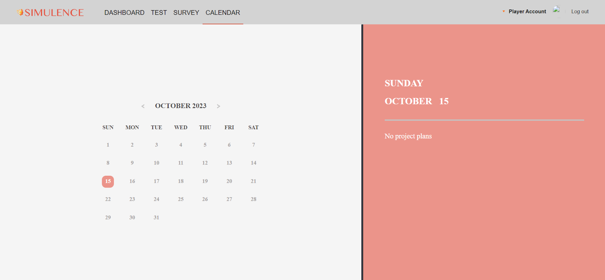
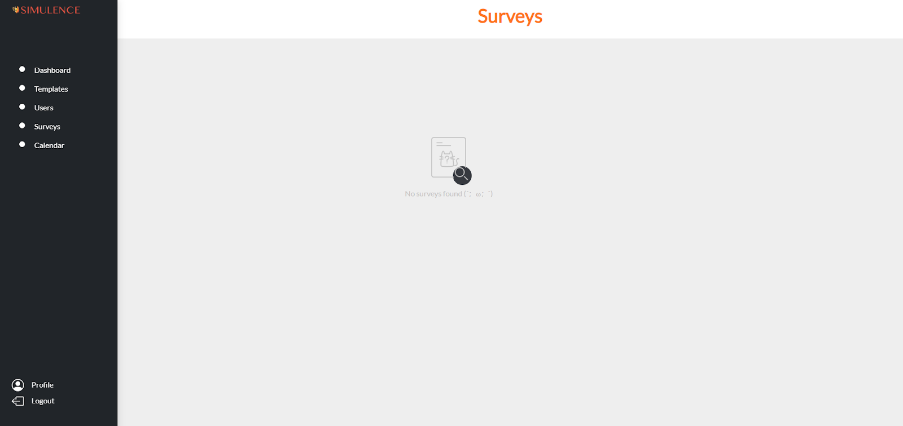
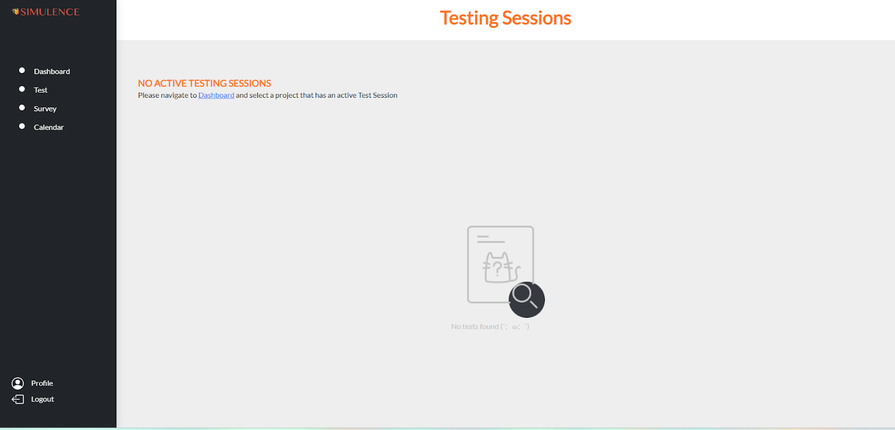
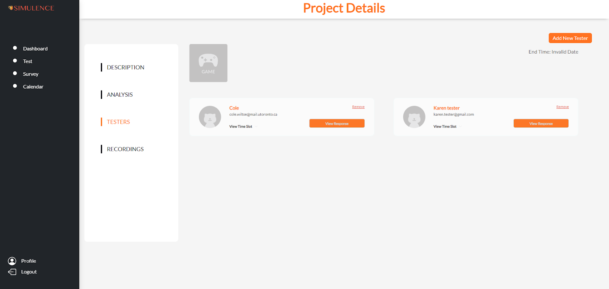
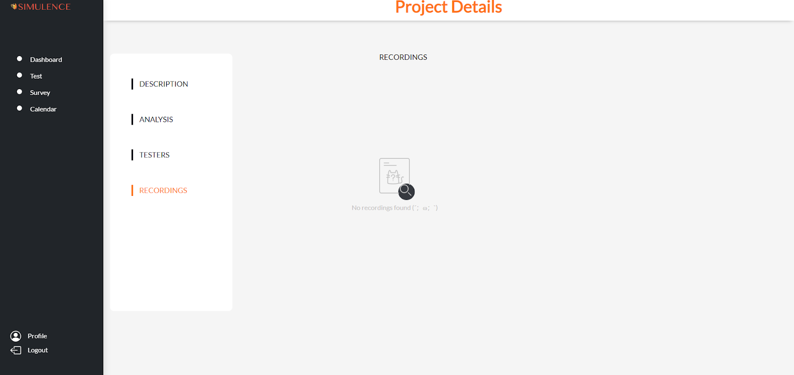
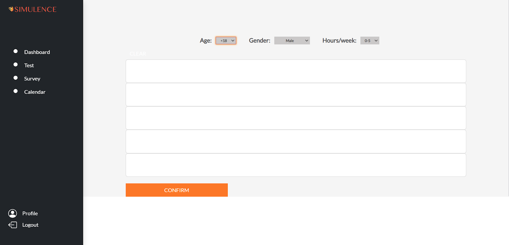

# Subteam 3: CSS Deliverable 2

### 1. A summary of your decisions and the options you considered for your component(s) (UI/frontend, logic/backend, database) so your TA knows what you have built and why. (Soft limit of 600 words. This doesn’t mean you have to write 600 words. Quality is more important than quantity).

Our subteam was focused on improving the user interface of the web application. This
included both improving on the CSS to touch up on the design of each component, as well as
rearranging and adding new components to improve the overall user interface. We found that
upon testing of the previous group’s application that the visuals of the web application lacked
presentable user interface, as well as user experience, in many of the different tabs, such as the
survey, testing, and calendar sections. As such, we decided that it would be reasonable to
dedicate a team to the aspect of the user experience of the web application.
A major flaw in the previous design was the design of buttons and dropdowns. For
example, the “End Test” button and some “Confirm” buttons were placed in unintuitive corners of
the screen, and often had a poor choice of color, font, and shape. In addition, there was an
unclear visual feedback mechanism to indicate whether an element is being interacted with,
which led to much confusion during our own testing of the program. We made significant
changes to the aforementioned UI elements and added visuals such as animations and hover
effects to make the webpage much easier to use and navigate.
For this deliverable, our subteam mainly focused on making the UI elements consistent
throughout the project, as there were multiple groups that worked on this project prior to our
group, and each of them left slightly different UI elements in the portions they worked on, which
ultimately resulted in an inconsistent look and feel across different sections. Our subteam
recognized the importance of a uniform and consistent user interface for improving the user
experience. To achieve this, we established a rough set of design guidelines regarding the size,
font, positioning, effects, etc of different UI elements that we will carry forward for the rest of the
project.

We also noticed that the CSS in this project is composed of only raw CSS, after this
deliverable, we plan to redo main portions of the project to incorporate bootstrap into the CSS.
Bootstrap will allow us to maintain a more consistent, easy-to-read interface throughout the
entire application, as well as provide us with any necessary UX features ready at hand for us to
implement.

### 2. Individual contributions explaining who did what. You can keep it to at most one paragraph per person to highlight any work that is not captured in any of the repos.

  Mahir worked on the Calendar tab, which required cleaning up in particular, as well as the
navbars. He made sure that the navbar was consistent among all the pages (as well as all types
of accounts, such as testers, developers, and administrators). Some pages were still using
navbars from past groups’ updates to the project.  
  Andy worked on the Test tab for developers and testers, which required a complete redesign so
that it has a similar theme and interface to the other pages. He modified buttons and other
interactive components across all users to be more intuitive to use and have clear feedback
mechanisms, such as an animation for the “clear” button on the game details page. He added
missing UI components to a few pages for the admin user so that they are consistent with other
users.  
  Samuel worked on going through adding the new navigation bar, as well as reformatting several
pages to be displayed in flex boxes instead of using absolute positioning and scaling, and
modifying some fonts and buttons to match a consistent style. He also worked mainly on the
style of the users and templates pages on the administrator account, ensuring each component
renders the flex boxes to display a user’s information (I don’t believe we are connected to the
database to actually gather the information yet)

### 3. All the details and instructions needed for your TA to see and verify your work. You need to provide enough documentation so your TA can confirm:
### a. Your software does what you say it does.
### b. You've done the work (i.e., it's something on your repo/servers, etc.).

Calender updates

Survey Page Update

Test session page update

Button changes

Recording page update

Tester Profile update

### 4. Your application (see deployment section below for details)

  The application is deployed at https://csc301-simulence-css-team-d2.web.app/, a
separate deployment for this deliverable.
  When our group merges with the work done with the other two subteams, the application itself
should be automatically deployed when pushing to the main branch.
Instructions to login are provided in the readme located in the subteam repository.
  To compare with the previous version prior to this deliverable, it is still hosted at
https://simulence-prod-3.web.app/
  When pushed to main, this should automatically update.
Login instructions should be the same, and it is provided by the previous team’s readme in the
repository.
