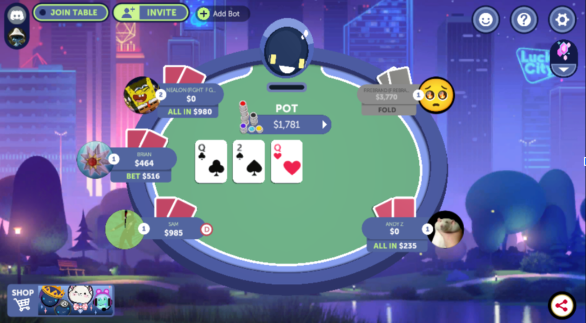

# YOUR PRODUCT/TEAM NAME
> _Note:_ This document will evolve throughout your project. You commit regularly to this file while working on the project (especially edits/additions/deletions to the _Highlights_ section). 
 > **This document will serve as a master plan between your team, your partner and your TA.**

## Product Details
 
#### Q1: What is the product?

 > Short (1 - 2 min' read)
 * Start with a single sentence, high-level description of the product.
 * Be clear - Describe the problem you are solving in simple terms.
 * Specify if you have a partner and who they are.
 * Be concrete. For example:
    * What are you planning to build? Is it a website, mobile app, browser extension, command-line app, etc.?      
    * When describing the problem/need, give concrete examples of common use cases.
    * Assume your the reader knows nothing about the partner or the problem domain and provide the necessary context. 
 * Focus on *what* your product does, and avoid discussing *how* you're going to implement it.      
   For example: This is not the time or the place to talk about which programming language and/or framework you are planning to use.
 * **Feel free (and very much encouraged) to include useful diagrams, mock-ups and/or links**.

**Simulence is a web-app designed for game developers to obtain feedback on their games that they upload to it, from a user base of playtesters. 
The idea is that the web app will provide a platform so that indie game developers can use it as a form of QA testing through surveys, reviews, and possibly streamed gameplay.

Indie game developers will be able to upload games and create surveys to collect responses and feedback from playtesters. They will be able to assign playtesters to review and play their game.
Playtesters will be able to download and play games uploaded, and leave reviews. They should be able to select and apply to review games of their choosing.**


#### Q2: Who are your target users?

  > Short (1 - 2 min' read max)
 * Be specific (e.g. a 'a third-year university student studying Computer Science' and not 'a student')
 * **Feel free to use personas. You can create your personas as part of this Markdown file, or add a link to an external site (for example, [Xtensio](https://xtensio.com/user-persona/)).**

**Our target users are indie game developers, who may not have the means to easily access or employ a team of QA testers. The web-app will facilitate a means to “crowdsource” playtesters. These developers would be able to interact with and receive feedback from these playtesters before possibly releasing their game.

Playtesters can range from people who want to try out new games, or even other indie developers who wish to help others on the website. We rely on the feedback provided by these playtesters, and so the site should be simple and convenient to use for them.**

#### Q3: Why would your users choose your product? What are they using today to solve their problem/need?

> Short (1 - 2 min' read max)
 * We want you to "connect the dots" for us - Why does your product (as described in your answer to Q1) fits the needs of your users (as described in your answer to Q2)?
 * Explain the benefits of your product explicitly & clearly. For example:
    * Save users time (how and how much?)
    * Allow users to discover new information (which information? And, why couldn't they discover it before?)
    * Provide users with more accurate and/or informative data (what kind of data? Why is it useful to them?)
    * Does this application exist in another form? If so, how does your differ and provide value to the users?
    * How does this align with your partner's organization's values/mission/mandate?

**Developers might not have the means to get a reliable team of QA testers for their games, (but might still want playtesters). Playtesters may want to help with the refining of new indie games and support smaller creators (they may be offered other incentives by developers as little thank-yous). Admin wants to facilitate and manage interactions between these groups, and hopefully turn a profit through user subscriptions.**

#### Q4: What are the user stories that make up the Minumum Viable Product (MVP)?

 * At least 5 user stories concerning the main features of the application - note that this can broken down further
 * You must follow proper user story format (as taught in lecture) ```As a <user of the app>, I want to <do something in the app> in order to <accomplish some goal>```
 * User stories must contain acceptance criteria. Examples of user stories with different formats can be found here: https://www.justinmind.com/blog/user-story-examples/. **It is important that you provide a link to an artifact containing your user stories**.
 * If you have a partner, these must be reviewed and accepted by them. You need to include the evidence of partner approval (e.g., screenshot from email) or at least communication to the partner (e.g., email you sent)

Link to artifact containing user stories [here](./User_Stories.pdf)
Link to proof of sending it to partner.

#### Q5: Have you decided on how you will build it? Share what you know now or tell us the options you are considering.

> Short (1-2 min' read max)
 * What is the technology stack? Specify languages, frameworks, libraries, PaaS products or tools to be used or being considered. 
 * How will you deploy the application?
 * Describe the architecture - what are the high level components or patterns you will use? Diagrams are useful here. 
 * Will you be using third party applications or APIs? If so, what are they?

Our partner has shared with us the codebase of the product, so we'll be largely adding on to that. Aside from HTML and CSS, the codebase itself uses Vue.js for the front-end, which we will continue to work in as it is a reasonably useful framework used in the industry as well, so it's helpful experience. Bootstrap is a library used in the front-end too, and we'll also be using that for similar reasons as before. Likewise, the same will be done with Firebase and Node.js for back-end/storage needs. As for the architecture, it is mainly a website displaying games and comments through cards and buttons, the appearance differing on whether the user is a playtester or game developer.

----
## Intellectual Property Confidentiality Agreement 
> Note this section is **not marked** but must be completed briefly if you have a partner. If you have any questions, please ask on Piazza.
>  
**By default, you own any work that you do as part of your coursework.** However, some partners may want you to keep the project confidential after the course is complete. As part of your first deliverable, you should discuss and agree upon an option with your partner. Examples include:
1. You can share the software and the code freely with anyone with or without a license, regardless of domain, for any use.
2. You can upload the code to GitHub or other similar publicly available domains.
3. You will only share the code under an open-source license with the partner but agree to not distribute it in any way to any other entity or individual. 
4. You will share the code under an open-source license and distribute it as you wish but only the partner can access the system deployed during the course.
5. You will only reference the work you did in your resume, interviews, etc. You agree to not share the code or software in any capacity with anyone unless your partner has agreed to it.

**Your partner cannot ask you to sign any legal agreements or documents pertaining to non-disclosure, confidentiality, IP ownership, etc.**

Briefly describe which option you have agreed to.

**3. You will only share the code under an open-source license with the partner but agree to not distribute it in any way to any other entity or individual. (Formally: MIT License)
Sam can use it however he likes pretty much without necessarily having to give us anything
We can definitely put it on our resume and show the code we each wrote individually to employers. (Maybe not the whole repo!)**


----

## Teamwork Details

#### Q6: Have you met with your team?

Do a team-building activity in-person or online. This can be playing an online game, meeting for bubble tea, lunch, or any other activity you all enjoy.
* Get to know each other on a more personal level.
* Provide a few sentences on what you did and share a picture or other evidence of your team building activity.
* Share at least three fun facts from members of you team (total not 3 for each member).

**Yes, we have had extensive conversations in our own Discord and formally met with our partner for the first time last Saturday. We spent a lot of time talking about our skills in Computer Science, and why we were so interested in a game-focused project. Turns out we all have some experience in game development! 

Fun Facts:
Nealon and Brian have worked together 3 times on making games for the UofT Game Development Club
Mahir and our partner, Sam, are super into Dungeons and Dragons
We had a lot of trouble coming up with a third fun fact because we aren’t that interesting, we literally talked about it for like a good five minutes and found nothing :D 👍👍
Andy Z’s discord profile pic is a hamster being delicately handled by the nape.**



#### Q7: What are the roles & responsibilities on the team?

Describe the different roles on the team and the responsibilities associated with each role. 
 * Roles should reflect the structure of your team and be appropriate for your project. One person may have multiple roles.  
 * Add role(s) to your Team-[Team_Number]-[Team_Name].csv file on the main folder.
 * At least one person must be identified as the dedicated partner liaison. They need to have great organization and communication skills.
 * Everyone must contribute to code. Students who don't contribute to code enough will receive a lower mark at the end of the term.

List each team member and:
 * A description of their role(s) and responsibilities including the components they'll work on and non-software related work
 * Why did you choose them to take that role? Specify if they are interested in learning that part, experienced in it, or any other reasons. Do no make things up. This part is not graded but may be reviewed later.

Nealon: Full-Stack, UX design and Firebase integration, Partner Liaison/Team Coordinator, Scrum Master. **Reason: Volunteered to be Team Coordinator and wanted to gain Full-Stack experience.**
Samuel: Front-End, Survey Database. **Reason: Eager to gain more experience in Front-End.**
Brian: Back-End, Survey Database, Scrum Master. **Reason: Preferred working in Back-End.**
Andy J.: Back-End, Survey Database. **Reason: Preferred working in Back-End.**
Andy Z.: Front-End, Survey Database. **Reason: Preferred working in Front-End.**
Michael: Full-Stack, I could do DevOps too, Survey Database. **Reason: Somewhat experienced in Full-Stack and DevOps and eager to gain more.**
Mahir: Front-End, UX Design, Can help with Firebase. **Reason: Preferred Front-End and is interested in aesthetics, but is willing to aid in Firebase.**

#### Q8: How will you work as a team?

Describe meetings (and other events) you are planning to have. 
 * When and where? Recurring or ad hoc? In-person or online?
 * What's the purpose of each meeting?
 * Other events could be coding sessions, code reviews, quick weekly sync meeting online, etc.
 * You should have 2 meetings with your project partner (if you have one) before D1 is due. Describe them here:
   * You must keep track of meeting minutes and add them to your repo under "documents/minutes" folder
   * You must have a regular meeting schedule established for the rest of the term.

We will be having hybrid meetings twice a week. There'll be meetings on Tuesday at 6PM with our partner Sam to discuss our progress and plans for the project, and to ensure we're on the right track. The other meeting will be internal meetings between members on Saturdays at 6PM to evaluate our own progress, compare contributions, ensure code is merged smoothly, and that everyone is working on their roles. Other than that, people working on the same sections of code will meet up in person every now and then informally to code together and ensure no conflicts in the codebase.
  
#### Q9: How will you organize your team?

List/describe the artifacts you will produce in order to organize your team.       

 * Artifacts can be To-Do lists, Task boards, schedule(s), meeting minutes, etc.
 * We want to understand:
   * How do you keep track of what needs to get done? (You must grant your TA and partner access to systems you use to manage work)
   * **How do you prioritize tasks?**
   * How do tasks get assigned to team members?
   * How do you determine the status of work from inception to completion?

**There will be an overall To-Do-List that summarizes the work that needs to be done on a high-level, such as components. Then, getting more granular, we will have smaller To-Do-Lists for the Front-End and Back-End portions. These will be in the Discord server, along with regular announcements regarding meetings and course updates, to ensure everyone is always on the same page. 

Meetings are held weekly on Saturdays at 5PM and we will always have someone to document the Meeting Minutes, rotating that responsibility weekly. At each meeting, we will discuss individual contributions and make adjustments to the current assignments to ensure a fair balance is achieved on time by all of us contribution-wise. Balance and punctuality, in regards to work, are the most important to us.**

#### Q10: What are the rules regarding how your team works?

**Communications:**
 * What is the expected frequency? What methods/channels will be used? 
 * If you have a partner project, what is your process for communicating with your partner?
 
**Collaboration: (Share your responses to Q8 & Q9 from A1)**
 * How are people held accountable for attending meetings, completing action items? Is there a moderator or process?
 * How will you address the issue if one person doesn't contribute or is not responsive?

**We have a Discord group for the 7 of us to talk and plan smaller details daily, and we meet weekly on Saturdays at 5PM. We also have access to the official Simulence Discord so we can talk with Sam and other people who have worked on Simulence in the past. For more formal communications, the team coordinator will contact Sam by email. 

Furthermore, the team coordinator (Nealon) will keep track of absences and contributions during the meeting, and if it is clear that members are slacking, he will report this to the group’s TA. The other’s are also to do this if the team coordinator is slacking.

Sam has said to put our schoolwork first – so we aren’t expected to put Simulence over getting decent grades, but we must be fair and should alert him if we have an especially busy week, for example.**

